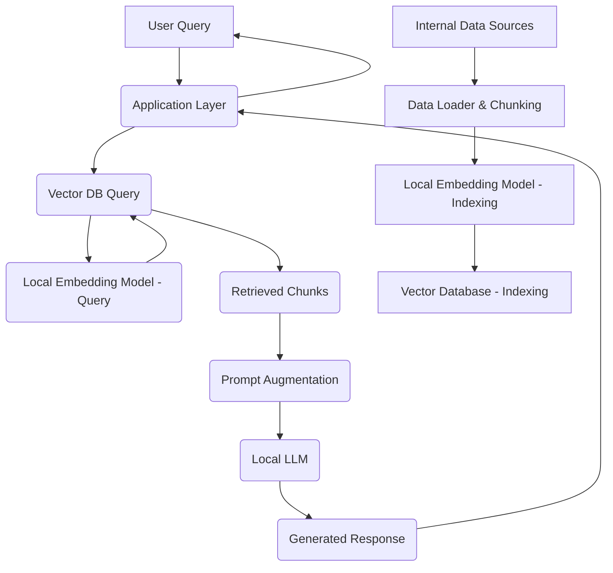

As AI rapidly transforms the tech landscape, the promise of enhanced user experiences and operational efficiency is undeniable. However, for businesses operating in regulated environments, particularly within the EU, the integration of Large Language Models (LLMs) comes with a significant challenge: GDPR compliance. At Zaamsflow, we understand that leveraging AI shouldn't compromise your commitment to data privacy.

This article, tailored for senior developers, CTOs, and tech leads, will guide you through implementing Retrieval-Augmented Generation (RAG) with *local* LLMs. This powerful combination offers a robust, privacy-first approach to AI, ensuring your sensitive data remains within your control, fully compliant with GDPR.

## The GDPR Imperative for AI

GDPR (General Data Protection Regulation) is not just a legal hurdle; it's a fundamental principle for handling personal data. When you send proprietary or customer-specific data to a third-party LLM API (e.g., OpenAI, Google Gemini), you relinquish direct control over that data. This creates several GDPR compliance risks:

*   **Data Residency:** Can you guarantee your data isn't processed outside the EU/EEA, or in a country without adequate data protection laws?
*   **Purpose Limitation:** Is the data strictly used for the specified purpose, or could it be used for model training by the provider?
*   **Data Minimisation:** Are you sending more data than necessary?
*   **Security of Processing:** Do you have auditable control over the security measures?
*   **Accountability:** As a data controller, you are ultimately responsible for data protection, even when using third-party processors.

For e-commerce platforms handling customer purchase histories, support tickets, or personal preferences, or SaaS providers managing client-specific configurations and sensitive business logic, these risks are amplified. The solution? Keep your data close.

## RAG and Local LLMs: A Privacy-First Synergy

**Retrieval-Augmented Generation (RAG)** is an architectural pattern that enhances LLMs by providing them with external, relevant, and up-to-date information at inference time. Instead of relying solely on the LLM's pre-trained knowledge (which might be outdated or lack specific business context), RAG works by:

1.  **Retrieval:** When a user queries, a retrieval component searches a private knowledge base (e.g., your product catalog, customer support docs) for relevant information.
2.  **Augmentation:** The retrieved information (the "context") is then prepended or injected into the prompt sent to the LLM.
3.  **Generation:** The LLM generates a response based on *both* its internal knowledge *and* the provided context.

**Local LLMs** complement RAG perfectly by allowing you to run models entirely within your own infrastructure – on-premises, in a private cloud, or even on dedicated servers. This means your sensitive data never leaves your controlled environment. Popular local LLM frameworks like Ollama, Llama.cpp, and even commercial solutions for on-prem deployment, make this increasingly feasible.

## Architectural Overview for GDPR-Compliant RAG

Here's a high-level view of an RAG system leveraging local LLMs, designed for GDPR compliance:

1.  **Data Source:** Your internal databases, documentation, CRM, product catalogs. All confidential and personal data resides here.
2.  **Data Loader & Chunking:** Processes data from the source, splits it into smaller, manageable "chunks" suitable for embedding.
3.  **Local Embedding Model:** A model (e.g., Sentence Transformers, BGE) run locally to convert text chunks into vector embeddings. No data leaves your network.
4.  **Vector Database:** Stores these embeddings. Can be open-source (e.g., Milvus, Weaviate, PGVector in PostgreSQL) or a self-hosted enterprise solution. Data is encrypted at rest.
5.  **Local LLM:** The generative model, running on your own servers (e.g., via Ollama), receives prompts augmented with retrieved context.
6.  **Application Layer (PHP/TypeScript):** Handles user queries, orchestrates retrieval, prompt augmentation, and LLM interaction.



## Practical Implementation Steps with Code Examples

Let's dive into practical steps, focusing on PHP for backend logic and a conceptual TypeScript example for interaction.

### Step 1: Data Ingestion & Chunking

First, you need to prepare your data. This involves loading documents (PDFs, database records, etc.) and splitting them into chunks.

```php
<?php
// In a real application, use a proper document loader and chunking library.
// For demonstration, let's assume we have a simple text content.

function chunkText(string $text, int $chunkSize = 500, int $overlap = 100): array
{
    // Simple, naive chunking for illustration. Production would use more advanced methods.
    $chunks = [];
    $words = preg_split('/\s+/', $text, -1, PREG_SPLIT_NO_EMPTY);
    $numWords = count($words);

    for ($i = 0; $i < $numWords; $i += ($chunkSize - $overlap)) {
        $chunk = array_slice($words, $i, $chunkSize);
        $chunks[] = implode(' ', $chunk);
    }
    return $chunks;
}

$documentContent = "Your comprehensive internal GDPR compliance document, detailing all data processing activities, policies, and procedures for customer data within your e-commerce platform. It includes personal data categories, processing purposes, legal bases, retention periods, and security measures.";
$chunks = chunkText($documentContent);

foreach ($chunks as $index => $chunk) {
    echo "Chunk ".$index.": ".$chunk."\n";
    // You would then embed and store each chunk.
}
?>
```

### Step 2: Local Embedding Generation

This is where you convert your text chunks into numerical vectors. We'll assume you have a local embedding service running (e.g., an Ollama instance with an embedding model like `nomic-embed-text` or a custom Python Flask API for Sentence Transformers).

```php
<?php
require 'vendor/autoload.php'; // Using Guzzle HTTP client

use GuzzleHttp\Client;

function getLocalEmbedding(string $text): ?array
{
    $client = new Client();
    try {
        // Example: Interacting with Ollama's embeddings API
        $response = $client->post('http://localhost:11434/api/embeddings', [
            'json' => [
                'model' => 'nomic-embed-text', // Or your chosen local embedding model
                'prompt' => $text
            ]
        ]);
        $data = json_decode($response->getBody()->getContents(), true);
        return $data['embedding'] ?? null;
    } catch (\Exception $e) {
        error_log("Error generating embedding: ".$e->getMessage());
        return null;
    }
}

$sampleChunk = "Customer data is processed only with explicit consent or legitimate interest.";
$embedding = getLocalEmbedding($sampleChunk);

if ($embedding) {
    echo "Generated embedding (first 5 values): ".implode(', ', array_slice($embedding, 0, 5))."...\n";
    // Store this embedding with its associated chunk text and metadata in your vector database.
} else {
    echo "Failed to generate embedding.\n";
}
?>
```

### Step 3: Vector Storage & Retrieval

Once you have embeddings, you store them in a vector database. When a user queries, you embed the query and perform a similarity search.

*(Conceptual TypeScript example for querying the RAG system)*

```typescript
import { createOllama } from 'ollama-ts'; // Using a hypothetical Ollama client library
import { PineconeClient } from '@pinecone-database/pinecone'; // Or your local vector DB client (e.g., pgvector client)

// Initialize Ollama client pointing to your local instance
const ollama = createOllama({ baseUrl: 'http://localhost:11434' });

// Initialize your vector database client (e.g., self-hosted Pinecone, Weaviate, or pgvector connection)
const pinecone = new PineconeClient(); // Replace with your actual client setup
await pinecone.init({ environment: 'YOUR_ENV', apiKey: 'YOUR_API_KEY' });
const index = pinecone.Index('gdpr-docs'); // Your GDPR knowledge base index

async function queryRAGSystem(prompt: string): Promise<string> {
    // 1. Generate embedding for the user's prompt using a local model
    const promptEmbeddingResult = await ollama.embeddings({
        model: 'nomic-embed-text',
        prompt: prompt,
    });
    const promptEmbedding = promptEmbeddingResult.embedding;

    if (!promptEmbedding) {
        throw new Error("Failed to generate prompt embedding locally.");
    }

    // 2. Retrieve relevant document chunks from your local vector database
    const queryResponse = await index.query({
        vector: promptEmbedding,
        topK: 5,
        includeMetadata: true,
        // Ensure namespace or filters if you segment data by client for multi-tenant SaaS
    });

    const relevantChunks = queryResponse.matches
        ?.map(match => match.metadata?.text || '')
        .filter(Boolean) as string[];

    if (relevantChunks.length === 0) {
        return "I couldn't find relevant information in my knowledge base. Please try rephrasing.";
    }

    // 3. Augment the prompt with the retrieved context
    const context = relevantChunks.join("\n\n");
    const llmPrompt = `Answer the following question truthfully and based ONLY on the provided context.\n\nContext:\n${context}\n\nQuestion: ${prompt}`;

    // 4. Send the augmented prompt to your local LLM
    const llmResponse = await ollama.generate({
        model: 'llama2',
        prompt: llmPrompt,
        stream: false,
    });

    return llmResponse.response;
}

// Example usage:
// queryRAGSystem("What are our data retention policies for customer purchase history?")
//     .then(console.log)
//     .catch(console.error);
```

## Practical Considerations and Best Practices

*   **Model Selection:** Choose smaller, performant models (e.g., Llama 3 8B, Mistral 7B) that can run efficiently on your hardware. Quantized models (e.g., GGUF format) are excellent for CPU-only or limited GPU setups.
*   **Hardware:** Running LLMs locally often requires significant compute resources, especially GPUs. Invest in appropriate infrastructure or explore managed private cloud solutions.
*   **Security Beyond RAG:** While local LLMs address data transfer, ensure your local infrastructure is secure: network isolation, access control, regular security audits, and data encryption at rest and in transit within your systems.
*   **Monitoring & Logging:** Implement robust monitoring for your local LLM and vector database, tracking performance, resource usage, and query logs. Ensure logging adheres to GDPR principles.
*   **Scalability:** Plan for scalability. Containerization (Docker, Kubernetes) can help manage and scale your local embedding services, vector databases, and LLM endpoints.
*   **Multi-tenancy (SaaS):** For SaaS products, ensure strict data isolation in your vector database (e.g., using namespaces or metadata filtering) so that one client's data never influences another's RAG responses.

## Real-World Applications for E-commerce & SaaS

*   **GDPR-Compliant Customer Support Chatbots:** Respond to customer queries about their data, order history, or privacy policies using their specific, private data, without exposing it to external AI services. Imagine a chatbot that can tell a customer exactly what data you hold on them, and why, based on *your* internal compliance documents and *their* user profile.
*   **Internal Knowledge Base Q&A:** Empower your employees to quickly find answers from proprietary internal documents (e.g., HR policies, project documentation, sales playbooks) using an AI assistant that never leaks sensitive company information.
*   **Personalized Product Recommendations:** Leverage a customer's private browsing history and purchase data (stored and processed locally) to provide highly personalized product recommendations, all while maintaining strict privacy control.

## Conclusion

Implementing RAG with local LLMs is a powerful strategy for any business serious about AI innovation and GDPR compliance. It allows you to harness the transformative power of generative AI while maintaining sovereign control over your most sensitive data. As senior developers and tech leaders, it's our responsibility to build secure, ethical, and compliant systems.

By following the principles outlined here, your organization can confidently integrate advanced AI capabilities into your e-commerce and SaaS platforms, providing cutting-edge experiences without compromising the trust of your users or the integrity of their data. Embrace local AI, embrace privacy, embrace the future.
