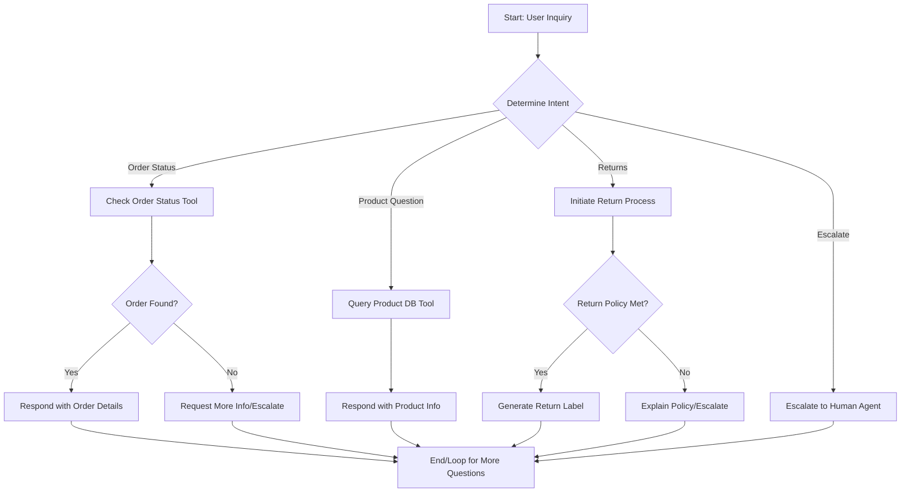

# Building Reliable AI Workflows with LangGraph for Scalable SaaS

Hello, fellow innovators! Hugo Platret here, your go-to for cutting-edge AI and robust PHP solutions. Today, we're diving deep into a topic critical for any senior developer or CTO looking to deploy AI beyond mere prototypes: building truly reliable, production-grade AI workflows. The promise of AI is immense, but the reality of integrating it into complex e-commerce or SaaS platforms often hits a wall of fragility and unpredictability. This is where LangGraph shines, offering a paradigm shift in how we architect AI agents.

## The Challenge: From Prompt to Production Hell

Many of us have experienced the frustration: an AI agent performs beautifully in controlled demos, but buckles under the weight of real-world edge cases, unexpected user inputs, or external system failures. Traditional sequential prompt chaining quickly becomes a tangled mess of conditional logic and error handling. We need more than just LLM calls; we need intelligent orchestration, state management, and the ability to course-correct dynamically. This is precisely the problem LangGraph was designed to solve.

## Enter LangGraph: Orchestrating Intelligence with State and Cycles

LangGraph, an extension of LangChain, is a library for building stateful, multi-actor applications with LLMs by modeling interactions as a graph. Think of it as a state machine for your AI agent, allowing complex, non-linear flows, dynamic decision-making, and robust error recovery.

### Key Concepts:

*   **Nodes**: These are the individual steps or actions in your workflow. A node can be an LLM call, a tool invocation (e.g., database lookup, API call), or even custom business logic written in PHP (executed via an API). Each node takes the current state and returns an update to that state.
*   **Edges**: These define the transitions between nodes. Edges can be conditional, meaning the next step depends on the output of the current node or specific values in the state.
*   **State**: This is the shared context that persists throughout the entire graph execution. It's how information is passed from one node to another and how the agent remembers previous interactions or outcomes.
*   **Cycles**: Unlike simple DAGs, LangGraph allows for cycles, which are crucial for building agents that can self-correct, re-evaluate, or engage in multi-turn conversations.

## Why LangGraph for E-commerce & SaaS Reliability?

1.  **Fault Tolerance & Self-Correction**: When an LLM hallucinates or a tool fails, LangGraph's cyclic nature allows you to define fallback paths. "If API call fails, retry; if LLM output is malformed, re-prompt with specific instructions; if user input is ambiguous, ask for clarification." This is gold for user experience.
2.  **Complex Decision-Making**: Go beyond simple `if/else` chains. LangGraph enables sophisticated routing based on multiple factors – user intent, historical data, external system status – leading to more intelligent and context-aware agents.
3.  **Human-in-the-Loop (HITL)**: Crucial for sensitive operations. You can easily design nodes where the workflow pauses, sends a notification to a human agent, and awaits approval or correction before proceeding. Imagine an AI-powered discount recommender that needs human sign-off for high-value promotions.
4.  **Structured Output & Validation**: By guiding the AI through specific tool calls and validation nodes, you can enforce structured outputs, making integration with backend systems much smoother. No more parsing free-form text with regex nightmares.
5.  **Auditability & Debugging**: The graph structure provides a clear visual representation of your agent's logic, making it easier to understand, debug, and audit its behavior. Each state transition is a traceable step.

## A Practical Example: E-commerce Customer Service AI Agent

Let's consider an AI agent designed to handle customer inquiries for an e-commerce platform. It needs to check order status, process returns, answer product questions, and escalate to a human when necessary.

### Simplified Graph Structure:



### Example LangGraph Node (TypeScript/JavaScript, as LangGraph is primarily in JS/Python):

```typescript
import { StateGraph, END } from '@langchain/langgraph';
import { ChatOpenAI } from '@langchain/openai';
import { DynamicTool } from '@langchain/core/tools';

// Define the state
interface AgentState {
  chatHistory: [string, string][];
  intent: string | null;
  orderId: string | null;
  productQuery: string | null;
  response: string | null;
}

// Define tools (these would call your PHP backend APIs)
const checkOrderTool = new DynamicTool({
  name: "check_order_status",
  description: "Checks the status of a customer order given an order ID.",
  func: async (orderId: string) => {
    // In a real app, this would be an API call to your PHP backend
    // E.g., fetch(`https://your-ecommerce.com/api/order/${orderId}`).then(res => res.json())
    if (orderId === "12345") {
      return "Order 12345: Shipped on 2023-10-26, tracking ABC123DEF";
    } else if (orderId === "67890") {
      return "Order 67890: Processing";
    }
    return "Order not found.";
  },
});

const queryProductTool = new DynamicTool({
  name: "query_product_database",
  description: "Queries the product database for information about a product by name or SKU.",
  func: async (query: string) => {
    // API call to PHP backend for product data
    if (query.toLowerCase().includes("laptop")) {
      return "Acme Laptop X: High-performance, 16GB RAM, 512GB SSD, currently in stock for $1200.";
    }
    return "No product found matching that query.";
  },
});

const model = new ChatOpenAI({ temperature: 0 });

// Nodes
const determineIntentNode = async (state: AgentState) => {
  const lastMessage = state.chatHistory[state.chatHistory.length - 1][1];
  const prompt = `Given the user message: "${lastMessage}", what is the user's primary intent? Choose from: order_status, product_question, initiate_return, escalate. If unsure, default to escalate.`;
  const result = await model.invoke(prompt);
  const intent = result.content.toString().trim();
  console.log("Determined Intent:", intent);
  return { ...state, intent: intent };
};

const callToolNode = async (state: AgentState) => {
  if (!state.intent) return state; // Should not happen if graph is well-defined

  let toolResult: string | null = null;
  let newResponse: string | null = null;

  switch (state.intent) {
    case "order_status":
      // Simple regex for order ID extraction, improve in production!
      const orderIdMatch = state.chatHistory[state.chatHistory.length - 1][1].match(/\b\d{5}\b/);
      const orderId = orderIdMatch ? orderIdMatch[0] : null;
      if (orderId) {
        toolResult = await checkOrderTool.invoke(orderId);
        newResponse = `Here's what I found for order ${orderId}: ${toolResult}.`;
        return { ...state, orderId, response: newResponse };
      } else {
        return { ...state, response: "Could you please provide your order ID?", intent: "clarify_order_id" };
      }
    case "product_question":
      const productQuery = state.chatHistory[state.chatHistory.length - 1][1]; // LLM could refine this query
      toolResult = await queryProductTool.invoke(productQuery);
      newResponse = `Regarding your product inquiry: ${toolResult}.`;
      return { ...state, productQuery, response: newResponse };
    case "initiate_return":
      return { ...state, response: "To initiate a return, please visit our returns portal at example.com/returns or provide your order ID for assistance.", intent: "await_user_action" };
    case "escalate":
      return { ...state, response: "I apologize, I'm unable to assist with that at the moment. I've escalated your query to a human agent who will contact you shortly.", intent: "human_handoff" };
    default:
      return { ...state, response: "I'm not sure how to handle that. Could you rephrase or try a different request?", intent: "rephrase" };
  }
};

// Build the graph
const workflow = new StateGraph<AgentState>()
  .addNode("determine_intent", determineIntentNode)
  .addNode("call_tool", callToolNode)
  .setEntryPoint("determine_intent")
  .addEdge("determine_intent", "call_tool")
  .addConditionalEdges(
    "call_tool",
    (state: AgentState) => state.intent === "clarify_order_id" ? "determine_intent" : END,
    {
      "clarify_order_id": "determine_intent", // Loop back to intent determination after clarification
      END: END // All other intents effectively end the turn for now
    }
  );

const app = workflow.compile();

// Example usage (PHP would call this via an API endpoint)
async function runAgent(userInput: string) {
  let finalState: AgentState = {
    chatHistory: [],
    intent: null,
    orderId: null,
    productQuery: null,
    response: null,
  };

  finalState.chatHistory.push(["user", userInput]);
  const result = await app.invoke(finalState);
  console.log("Agent Response:", result.response);
  return result;
}

// PHP would expose an endpoint like /api/chat that calls this.
// For example, a PHP controller might look something like this:
/*
class ChatController {
    public function handleUserMessage(Request $request): JsonResponse {
        $userInput = $request->input('message');
        // Make an HTTP POST request to your Node.js/TypeScript LangGraph service
        $client = new \GuzzleHttp\Client();
        $response = $client->post('http://langgraph-service:3000/invoke-agent', [
            'json' => ['message' => $userInput]
        ]);
        $responseData = json_decode($response->getBody()->getContents(), true);
        return new JsonResponse($responseData);
    }
}
*/

runAgent("What's the status of order 12345?");
runAgent("Tell me about your best gaming laptop.");
runAgent("I want to return an item.");
runAgent("I need to speak to someone right now.");
runAgent("Can you find order 99999?"); // Will prompt for clarification or show not found
```

In this example, the `call_tool` node has a conditional edge. If the agent needs to clarify an order ID, it loops back to `determine_intent` after providing a clarification prompt. Otherwise, it proceeds to `END` (or another appropriate node for generating a final response and potentially looping for more questions).

### Bridging LangGraph (JS/Python) with PHP Applications

While LangGraph itself is primarily in Python or JavaScript, its integration into a robust PHP ecosystem is straightforward: expose your LangGraph agent as a microservice.

1.  **Dedicated LangGraph Service**: Run your LangGraph application in a Node.js or Python environment, exposing a clean REST API (e.g., `/api/chat/invoke`).
2.  **PHP Integration**: Your PHP backend (Laravel, Symfony, etc.) acts as the orchestrator. When a user interacts with your AI, your PHP application makes an HTTP request to the LangGraph service with the user's input and potentially current session state.
3.  **State Management**: The LangGraph service handles the internal state of the conversation. The PHP application can store a `thread_id` or `session_id` to ensure continuity across requests.
4.  **Tools & Business Logic**: LangGraph's "tools" would typically be API calls *back* to your PHP backend. For instance, `check_order_status` in LangGraph would call `your-ecommerce.com/api/orders/{id}` which is handled by a PHP controller.

This architecture keeps your concerns separated: LangGraph manages the AI's internal reasoning and flow, while PHP handles core business logic, database interactions, and the primary application facade.

## Monitoring and Maintenance

Reliability isn't just about building; it's about operating. With LangGraph, you gain greater transparency into your AI's decisions. Implement:

*   **Structured Logging**: Log node transitions, tool invocations, and state changes. This is invaluable for debugging and understanding agent behavior.
*   **Tracing**: Tools like LangSmith (from LangChain) or OpenTelemetry can provide detailed traces of your graph's execution path, highlighting bottlenecks or failures.
*   **Alerting**: Set up alerts for specific node failures, `escalate_to_human` events, or unexpected loops, allowing for proactive intervention.

## Conclusion

Building reliable AI workflows is no longer a pipe dream. LangGraph provides the architectural backbone to move beyond brittle prompt engineering to sophisticated, stateful, and resilient AI agents. For senior developers and CTOs leading teams in e-commerce or SaaS, embracing LangGraph means delivering AI solutions that truly perform in the chaotic reality of production. By integrating these powerful graph-based agents with your existing PHP systems, you can unlock new levels of automation, customer satisfaction, and operational efficiency.

Ready to build some truly intelligent and robust AI? Start experimenting with LangGraph today – your future self (and your users) will thank you for it.

---
