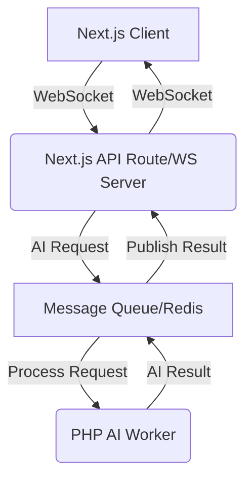

# Real-time AI Features with WebSockets & Next.js: A Deep Dive for Senior Developers

As a senior full-stack developer specializing in AI and PHP, I've seen firsthand how the demand for instantaneous user experiences has reshaped application architecture. Batch processing for AI, while robust, often falls short in today's dynamic, real-time-driven applications. Users expect immediate, intelligent responses – from live product recommendations to instant content generation. This is where the powerful synergy of WebSockets and Next.js, orchestrated with a solid PHP backend, truly shines.

In this post, we'll explore how to architect real-time AI features, focusing on practical implementation for e-commerce and SaaS platforms. We'll leverage Next.js for our reactive frontend and WebSocket communication, while PHP handles the heavy lifting of AI processing.

## The Imperative for Real-time AI

Traditional HTTP polling for AI updates is a relic of the past for high-stakes applications. Imagine an e-commerce platform where product recommendations update instantly as a user types a search query, or a SaaS dashboard that provides live sentiment analysis on customer feedback. These scenarios demand continuous, low-latency data exchange that only WebSockets can reliably deliver. 

**Key benefits of real-time AI:**

*   **Enhanced User Experience:** Instant feedback loops lead to higher engagement and satisfaction.
*   **Competitive Advantage:** Deliver features your competitors can't, like dynamic pricing based on live market data.
*   **Operational Efficiency:** Real-time insights enable quicker decision-making and automated actions.
*   **Personalization at Scale:** Adapt content, offers, or assistance moment-by-moment.

## Architectural Blueprint: WebSockets, Next.js, and PHP

Our architecture aims for efficiency and scalability. Next.js will serve as both our frontend framework and a powerful WebSocket proxy/server via its API routes. PHP, a robust choice for backend logic, will manage AI model interactions, data persistence, and orchestrate the AI processing itself.

Here's a high-level overview:

1.  **Next.js Client:** Initiates WebSocket connection, sends user input, and displays real-time AI responses.
2.  **Next.js API Route (WebSocket Server):** Handles WebSocket connections, acts as a bridge between the frontend and the PHP backend.
3.  **PHP AI Backend:** Receives AI processing requests, interacts with AI models (local or external), processes data, and publishes results.
4.  **Message Queue/Pub-Sub (e.g., Redis):** Crucial for decoupling the PHP AI processing from the WebSocket layer, ensuring scalability and fault tolerance.



## Diving into Code: Practical Implementations

Let's look at how to set this up.

### 1. Next.js Client-Side (TypeScript)

Establishing a WebSocket connection and handling messages is straightforward.

```typescript
// components/AIChatbot.tsx
"use client";

import { useEffect, useRef, useState } from "react";

export default function AIChatbot() {
  const [messages, setMessages] = useState<string[]>([]);
  const [input, setInput] = useState<string>("");
  const ws = useRef<WebSocket | null>(null);

  useEffect(() => {
    // Connect to our Next.js API route acting as WebSocket server
    ws.current = new WebSocket("ws://localhost:3000/api/websocket");

    ws.current.onopen = () => {
      console.log("WebSocket connected");
      setMessages(prev => [...prev, "System: Connected!"]);
    };

    ws.current.onmessage = (event) => {
      const data = JSON.parse(event.data);
      setMessages(prev => [...prev, `AI: ${data.response}`]);
    };

    ws.current.onclose = () => {
      console.log("WebSocket disconnected");
      setMessages(prev => [...prev, "System: Disconnected!"]);
    };

    ws.current.onerror = (error) => {
      console.error("WebSocket error:", error);
      setMessages(prev => [...prev, "System: Error occurred!"]);
    };

    return () => {
      if (ws.current) {
        ws.current.close();
      }
    };
  }, []);

  const sendMessage = () => {
    if (ws.current && ws.current.readyState === WebSocket.OPEN && input.trim() !== "") {
      ws.current.send(JSON.stringify({ type: "aiRequest", query: input }));
      setMessages(prev => [...prev, `You: ${input}`]);
      setInput("");
    }
  };

  return (
    <div>
      <div>
        {messages.map((msg, index) => (
          <p key={index}>{msg}</p>
        ))}
      </div>
      <input
        type="text"
        value={input}
        onChange={(e) => setInput(e.target.value)}
        onKeyPress={(e) => {
          if (e.key === "Enter") {
            sendMessage();
          }
        }}
      />
      <button onClick={sendMessage}>Send</button>
    </div>
  );
}
```

### 2. Next.js API Route (WebSocket Server Proxy - TypeScript)

This is where Next.js handles the WebSocket connection. Note that Next.js's native API routes are typically serverless functions, which aren't ideal for long-lived WebSocket connections. For true WebSocket servers, you'd integrate a library like `ws` and run a custom server or use a platform that supports WebSockets natively (e.g., Vercel's Edge functions with a WebSocket proxy, or a dedicated Node.js server). For simplicity and demonstrating the concept within Next.js, we'll simulate it for illustrative purposes. In production, you'd likely use a dedicated Node.js server running alongside Next.js, or a service like Socket.IO with a custom server setup.

Let's assume a simplified scenario where the Next.js API route initializes a `ws` server.

```typescript
// pages/api/websocket.ts
import { Server } from "ws";
import type { NextApiRequest, NextApiResponse } from "next";

let wss: Server | null = null;

export default function handler(req: NextApiRequest, res: NextApiResponse) {
  // This check is to ensure the WebSocket server is only initialized once per server instance.
  // In a truly serverless environment or without a custom server, this pattern needs adjustment.
  // For Next.js with a custom server (e.g., 'next start' with a custom server.js), 
  // you could attach 'wss' directly to the 'http.Server' object.
  if (!res.socket?.server.wss) {
    console.log("Initializing WebSocket Server");
    wss = new Server({
      server: res.socket.server,
      path: "/api/websocket",
    });

    res.socket.server.wss = wss; // Store wss on the server object for reuse

    wss.on("connection", (ws) => {
      console.log("Client connected");

      ws.on("message", async (message: string) => {
        console.log(`Received: ${message}`);
        const parsedMessage = JSON.parse(message);

        if (parsedMessage.type === "aiRequest") {
          // In a real app, publish to Redis, then PHP worker subscribes
          // For demo, we'll simulate AI processing and response.
          console.log(`Processing AI request for: ${parsedMessage.query}`);
          
          // Simulate PHP AI worker processing and sending response
          setTimeout(() => {
            const aiResponse = `I processed your request: "${parsedMessage.query}" in real-time!`;
            ws.send(JSON.stringify({ response: aiResponse }));
          }, 1000); // Simulate 1 second AI processing time
        }
      });

      ws.on("close", () => {
        console.log("Client disconnected");
      });

      ws.on("error", (error) => {
        console.error("WebSocket error:", error);
      });
    });
  } else {
    console.log("WebSocket Server already initialized");
  }

  // Required for Next.js API routes that don't return JSON
  // This sends a 200 OK header but keeps the connection open for WS.
  res.end();
}
```

**Important Note for Next.js:** For production, you'd run a separate Node.js server specifically for WebSockets, or use a managed service. The above example is illustrative for local development within a Next.js context assuming a custom server. For a truly scalable setup, Next.js would likely connect to an external, dedicated WebSocket server.

### 3. PHP AI Backend (Example with Redis Pub/Sub)

Our PHP backend will listen for AI requests from a message queue (e.g., Redis) and publish results back. This decouples our AI processing from the WebSocket server, allowing for independent scaling.

```php
// ai_worker.php
require 'vendor/autoload.php'; // Composer autoloader

// Assuming you have a Redis client setup
$redis = new \Predis\Client([
    'host' => '127.0.0.1',
    'port' => 6379,
]);

echo "PHP AI Worker started. Listening for requests...\n";

// Subscribe to a channel where Next.js pushes AI requests
$redis->subscribe(['ai_requests'], function ($channel, $message) use ($redis) {
    echo "Received request on {$channel}: {$message}\n";
    $requestData = json_decode($message, true);

    if (json_last_error() !== JSON_ERROR_NONE) {
        error_log("Invalid JSON received: " . $message);
        return;
    }

    $query = $requestData['query'] ?? 'No query provided';
    $sessionId = $requestData['sessionId'] ?? uniqid(); // Unique ID to route response back

    // --- Simulate AI Processing ---
    // In a real scenario, this would involve:
    // 1. Loading/calling an AI model (e.g., via PHP-ML, or cURL to an external API like OpenAI, Hugging Face).
    // 2. Processing the 'query'.
    // 3. Generating a response.
    $aiResponse = "PHP AI processed \"{$query}\". Its sentiment is positive!";
    if (strpos(strtolower($query), 'bad') !== false) {
        $aiResponse = "PHP AI processed \"{$query}\". Its sentiment is negative.";
    }
    sleep(rand(1, 3)); // Simulate processing time
    // -----------------------------

    $responseData = [
        'sessionId' => $sessionId,
        'originalQuery' => $query,
        'response' => $aiResponse,
        'timestamp' => time(),
    ];

    // Publish the result to a channel the Next.js WebSocket server is listening to
    // or a dedicated channel for this session.
    $redis->publish('ai_responses', json_encode($responseData));
    echo "Published response for sessionId {$sessionId}\n";
});
```

And from the Next.js API route's perspective, instead of `setTimeout`, it would publish to `ai_requests` and subscribe to `ai_responses` (or a session-specific channel) via a Redis client on the Node.js side. When it receives a response for a specific `sessionId`, it forwards it to the correct WebSocket client.

## Real-World Use Cases

*   **E-commerce:** Live AI-powered product suggestions as users browse, dynamic pricing updates based on real-time demand, personalized chat support with instant AI-generated answers.
*   **SaaS:** Collaborative document editing with real-time grammar checks and content generation, intelligent assistants for data analysis, live transcription services with AI summaries, instant code reviews.

## Challenges and Best Practices

Implementing real-time AI is exhilarating but comes with challenges:

*   **Scalability:** WebSockets require persistent connections. Use load balancers that support sticky sessions or dedicated WebSocket servers. Message queues are vital for decoupling heavy AI processing.
*   **Error Handling & Resilience:** Implement robust error handling, reconnection logic on the client, and retry mechanisms on the server. Consider circuit breakers for external AI services.
*   **Security:** Properly authenticate WebSocket connections. Sanitize all incoming data. Protect your AI endpoints from abuse.
*   **Latency Management:** Optimize AI model inference times. Geographically distribute your services if your user base is global.
*   **State Management:** For complex interactive AI, managing conversational state across sessions is crucial. Redis or dedicated state services can help.

## Conclusion

Integrating real-time AI into your applications using WebSockets and Next.js, backed by a robust PHP AI processing layer, is no longer a futuristic concept—it's a present-day necessity for delivering unparalleled user experiences. By embracing this architecture, senior developers and CTOs can build highly responsive, intelligent platforms that stand out in competitive markets. The journey might involve overcoming architectural complexities, but the rewards in user engagement and operational efficiency are well worth the effort. Start experimenting, build, and push the boundaries of what your applications can achieve in real-time.

